# Heart Disease Analysis
## Exploratory Data Analysis and Predictive Modeling using the UCI Cleveland Dataset

**Author:** Peter Adepoju \
**Email:** petera@aims.ac.za

---

## Abstract

This project analyzes the UCI Cleveland heart disease dataset to understand
clinical patterns and compare predictive models for disease presence.

Key results:
- The dataset is reasonably balanced: 160 patients without heart disease and 137 with heart disease.
- Patients with heart disease are older on average and show lower maximum heart rate and higher oldpeak values.
- Random Forest is the strongest model, reaching 0.867 accuracy, 0.864 balanced accuracy, and 0.941 ROC-AUC.
- The most important features are chest pain type (`cp`), thalassemia (`thal`), maximum heart rate (`thalach`), oldpeak, and number of vessels (`ca`).

The report includes the full exploratory analysis, visual summaries, model comparison, and interpretation of the most relevant risk factors.

---

## 1. Introduction

Heart disease remains one of the most important clinical risk areas in predictive
health analytics. The UCI Cleveland dataset provides a compact but useful
collection of patient attributes that can be explored for:

1. Understanding how clinical variables differ between patients with and without heart disease.
2. Identifying visual patterns that separate the two groups.
3. Comparing simple machine learning models for disease prediction.

Research questions:

1. Which variables show the clearest relationship with heart disease?
2. How well can standard classification models predict disease presence?
3. Which features are most influential in the best-performing model?

---

## 2. Data

- Dataset: UCI Cleveland Heart Disease Dataset
- Source: [UCI Machine Learning Repository](https://archive.ics.uci.edu/ml/datasets/Heart+Disease)
- Raw file: [`data/raw/heart_cleveland_raw.csv`](data/raw/heart_cleveland_raw.csv)
- Clean file: [`data/processed/heart_cleveland_clean.csv`](data/processed/heart_cleveland_clean.csv)
- Sample size: 297 patients after cleaning
- Target: 0 = no heart disease, 1 = heart disease present

### Data Summary

| Class | Count | Share |
|---|---:|---:|
| No heart disease | 160 | 53.9% |
| Heart disease | 137 | 46.1% |

### Key Variables

- `age`: patient age
- `sex`: biological sex
- `cp`: chest pain type
- `trestbps`: resting blood pressure
- `chol`: serum cholesterol
- `fbs`: fasting blood sugar
- `restecg`: resting electrocardiographic results
- `thalach`: maximum heart rate achieved
- `exang`: exercise-induced angina
- `oldpeak`: ST depression induced by exercise
- `slope`: slope of peak exercise ST segment
- `ca`: number of major vessels colored by fluoroscopy
- `thal`: thalassemia status

### Data Limitations

- The dataset is small, so model estimates may vary across splits.
- It captures clinical measurements only, not broader lifestyle or longitudinal history.
- The target has already been binarized, so severity levels are not modeled separately.

---

## 3. Methods

### 3.1 Data Preparation

- Loaded the raw Cleveland heart disease file.
- Cleaned missing and inconsistent entries.
- Converted the raw `target` variable into a binary class label.
- Split the data into training and test sets.
- Standardized numerical features for the linear model.

### 3.2 Exploratory Analysis

- Checked class balance.
- Compared continuous feature distributions by disease status.
- Examined correlations between variables and the target.
- Studied disease rates by chest pain type and sex.

### 3.3 Modeling

The project compares four classifiers:

- Dummy Classifier
- Logistic Regression
- Decision Tree
- Random Forest

### 3.4 Evaluation

Models were evaluated with:

- Accuracy
- Balanced accuracy
- Precision
- Recall
- F1-score
- ROC-AUC

---

## 4. Results

### 4.1 Exploratory Findings

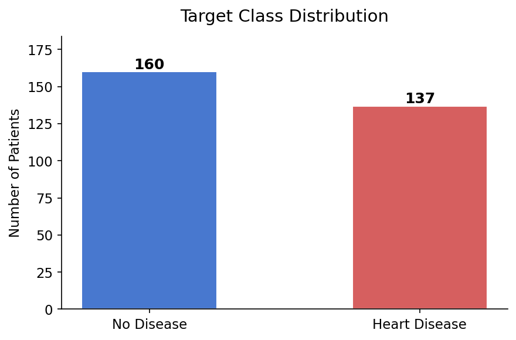

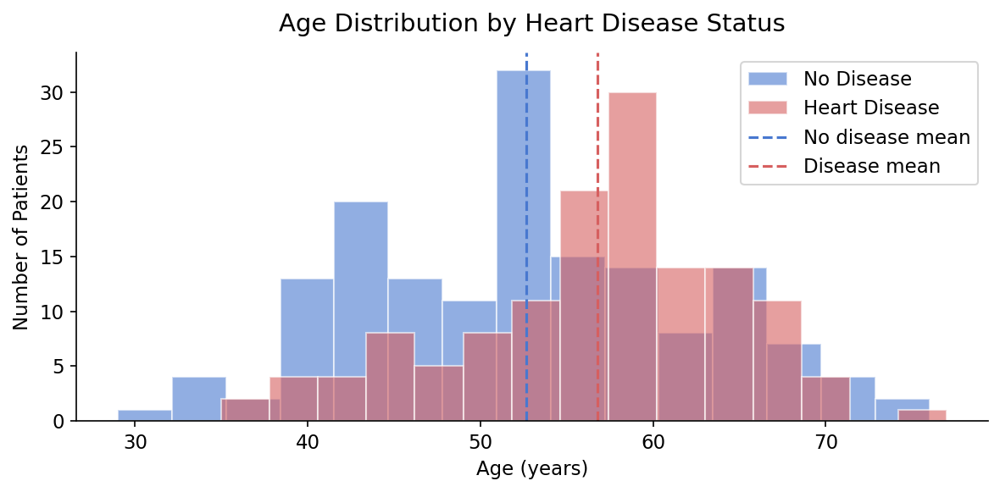

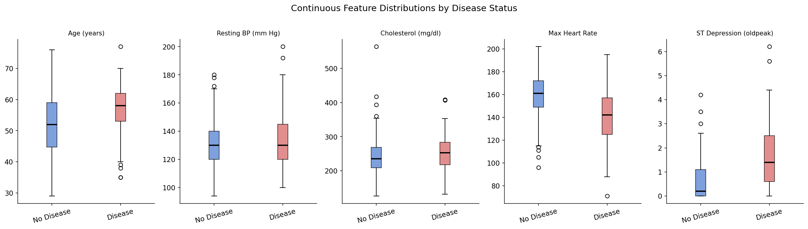

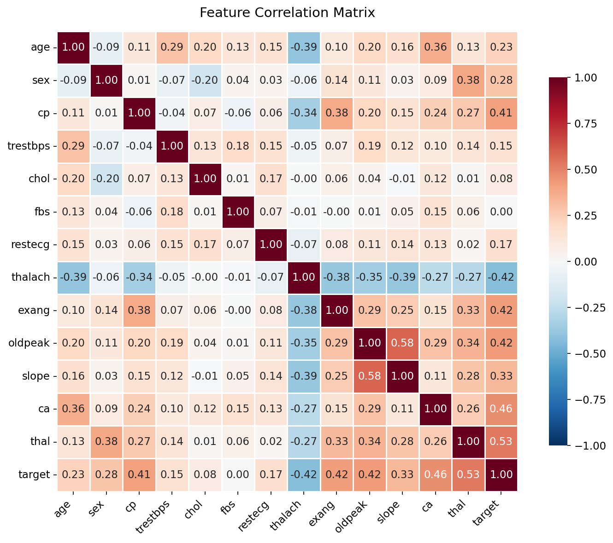

Patients with heart disease tend to be older, have lower `thalach`, and show
higher `oldpeak` values. The class balance is close enough that accuracy remains
informative, though balanced accuracy is still important for comparison.

### 4.2 Clinical Patterns

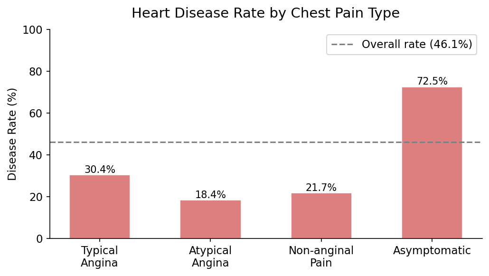

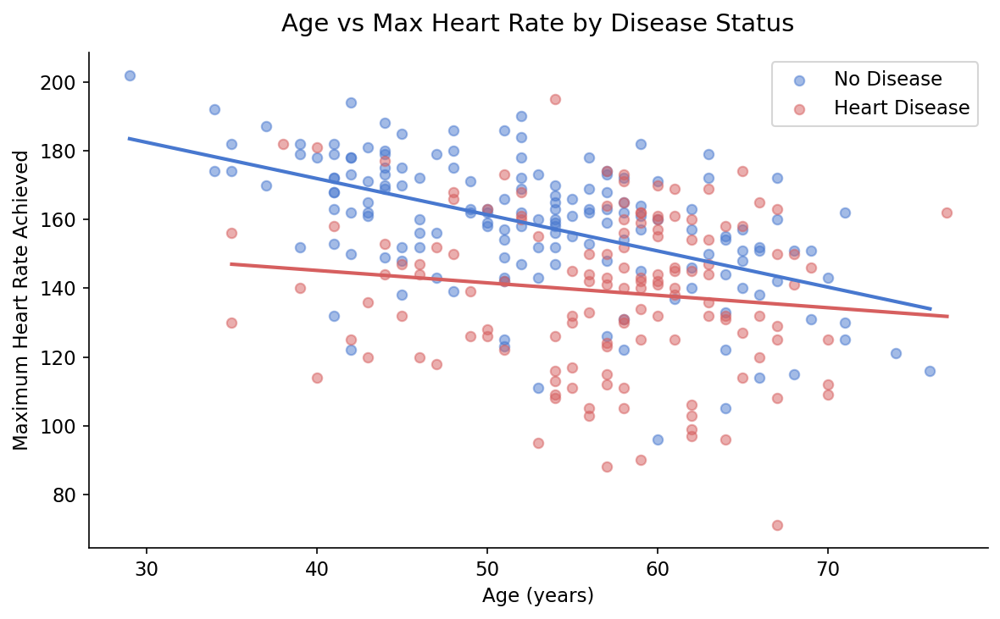

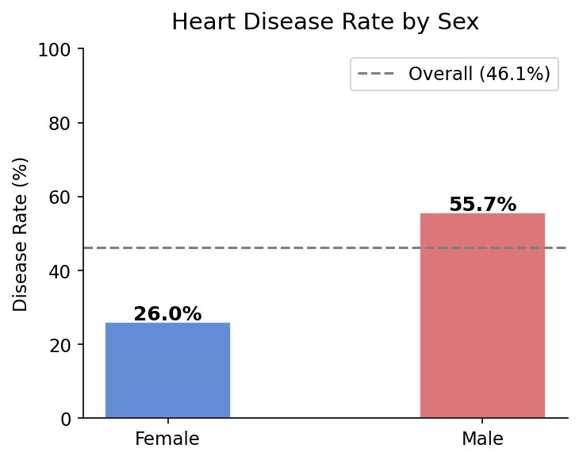

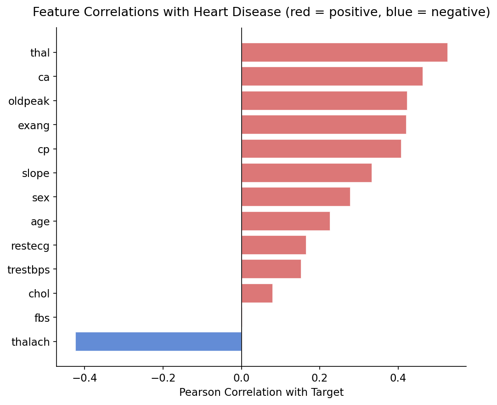

The strongest patterns in the visual analysis are:

- Chest pain type is strongly associated with disease presence.
- Lower maximum heart rate is linked to a higher disease rate.
- Male patients show a higher disease rate than female patients in this sample.
- `thalach`, `oldpeak`, and `ca` stand out as useful predictors.

### 4.3 Model Performance

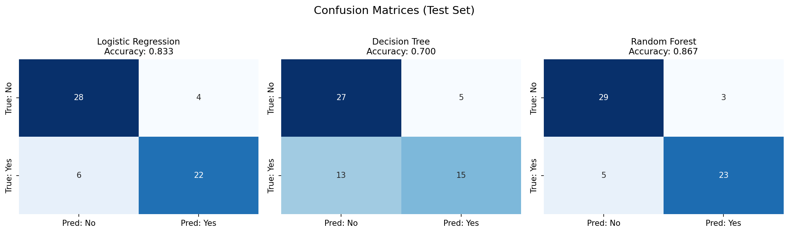

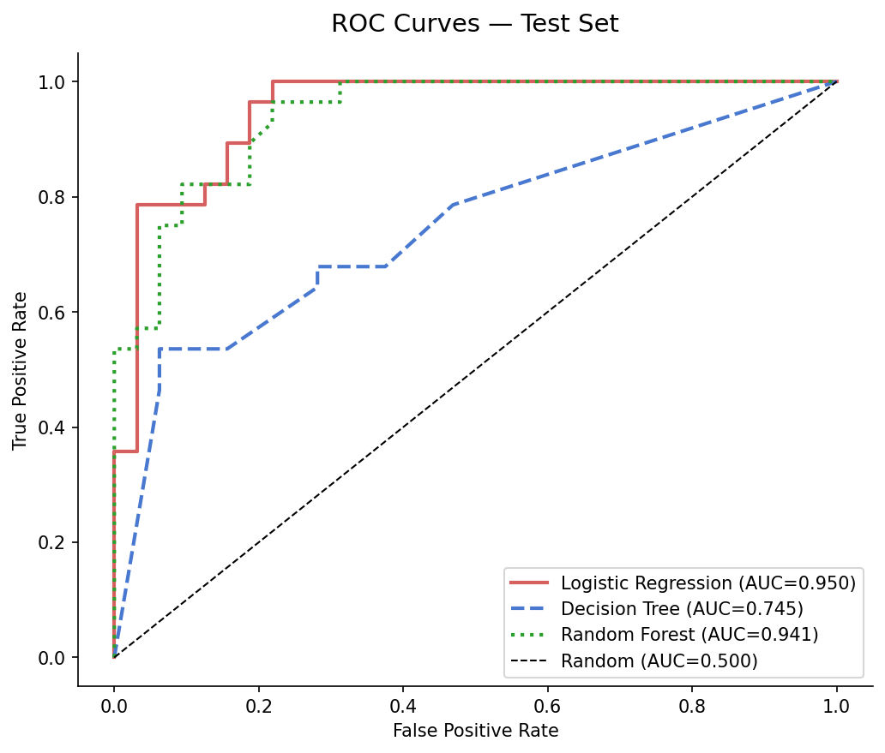

| Model | Accuracy | Balanced Acc. | Precision | Recall | F1-Score | ROC-AUC |
|---|---:|---:|---:|---:|---:|---:|
| Dummy Classifier | 0.533 | 0.500 | 0.000 | 0.000 | 0.000 | 0.500 |
| Logistic Regression | 0.833 | 0.830 | 0.846 | 0.786 | 0.815 | 0.950 |
| Decision Tree | 0.700 | 0.690 | 0.750 | 0.536 | 0.625 | 0.745 |
| Random Forest | 0.867 | 0.864 | 0.885 | 0.821 | 0.852 | 0.941 |

Random Forest performs best overall on accuracy, balanced accuracy, and F1-score.
Logistic Regression also performs very well and produces the highest ROC-AUC.

### 4.4 Feature Importance

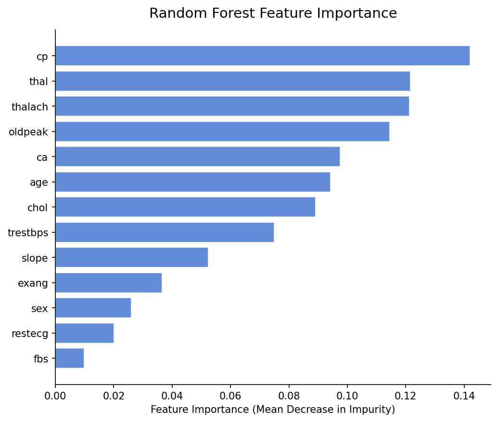

Top five Random Forest features:

| Rank | Feature | Importance |
|---|---|---:|
| 1 | `cp` | 0.1420 |
| 2 | `thal` | 0.1216 |
| 3 | `thalach` | 0.1213 |
| 4 | `oldpeak` | 0.1146 |
| 5 | `ca` | 0.0975 |

These results suggest that chest pain type and exercise-related indicators carry
the most signal for the model.

---

## 5. Discussion

1. The dataset is only mildly imbalanced, so the classification task is not
   dominated by one class.
2. Clinical variables related to exercise response are the most useful signals in
   both the exploratory analysis and the model.
3. Random Forest gives the strongest overall test-set performance, while
   Logistic Regression remains a strong and interpretable benchmark.
4. The feature importance ranking is consistent with the visual patterns seen in
   the report figures.

Recommended next steps:

1. Use cross-validation or repeated splits to check stability.
2. Explore calibration if the model will be used for risk ranking.
3. Expand the analysis with additional clinical or longitudinal data if available.

---

## 6. Limitations

- The sample size is small for machine learning.
- The dataset does not include treatment history or lifestyle variables.
- The target is binary, so disease severity is not modeled separately.
- Results should be interpreted as exploratory rather than clinical guidance.

---

## 7. Reproducibility

Install the dependencies:

```bash
pip install -r requirements.txt
```

Then open the notebooks:

```bash
jupyter notebook
```

---

## 8. Project Structure

```text
week1_project/
|-- data/                 # Raw and processed data
|-- notebooks/            # Analysis notebooks
|-- reports/              # Figures and tables used in the report
|   |-- figures/
|   `-- tables/
|-- src/                  # Reusable helper code
|-- heart_disease_full_report.pdf
|-- requirements.txt
`-- README.md
```

For the full technical write-up, see:

- [Heart Disease Full Report](./heart_disease_full_report.pdf)
