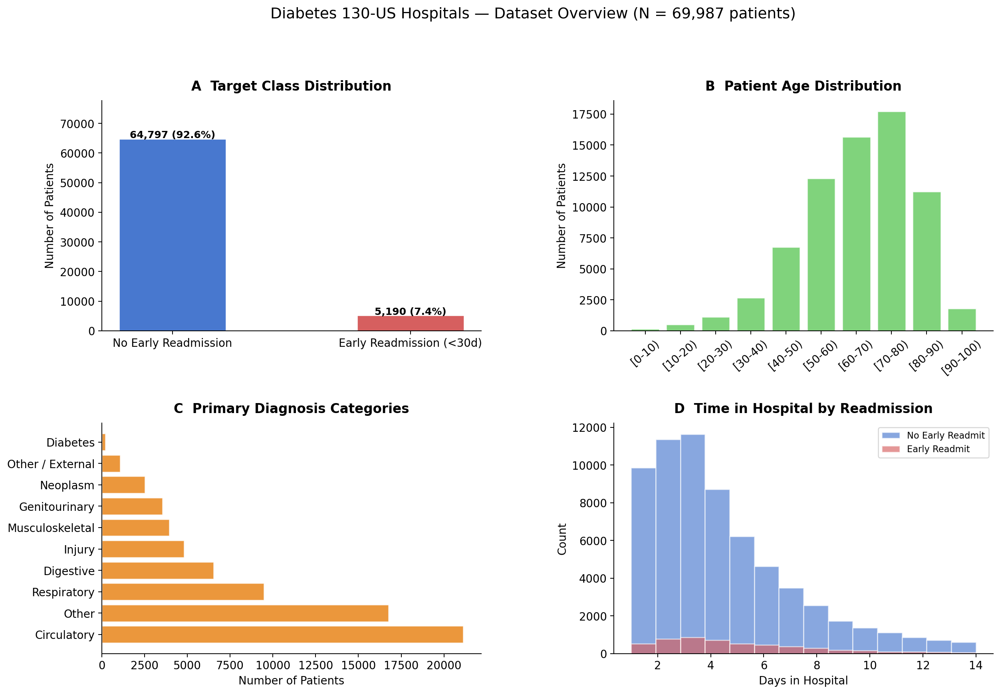
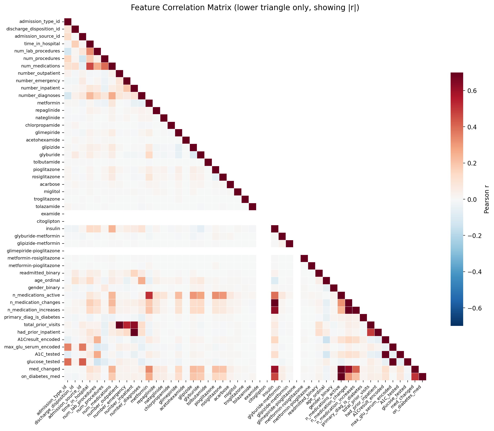
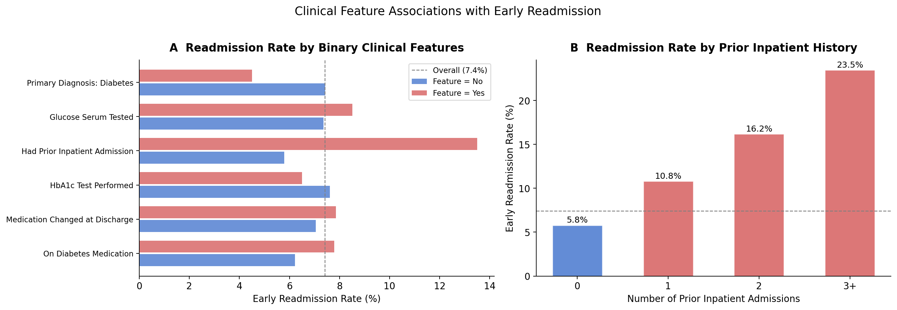
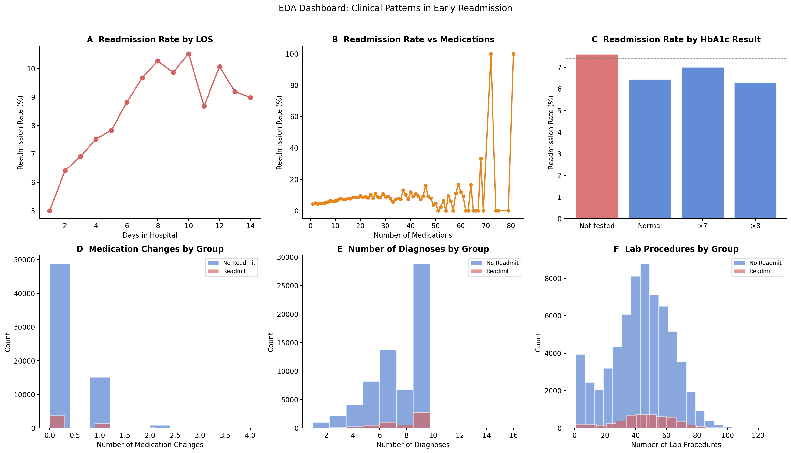
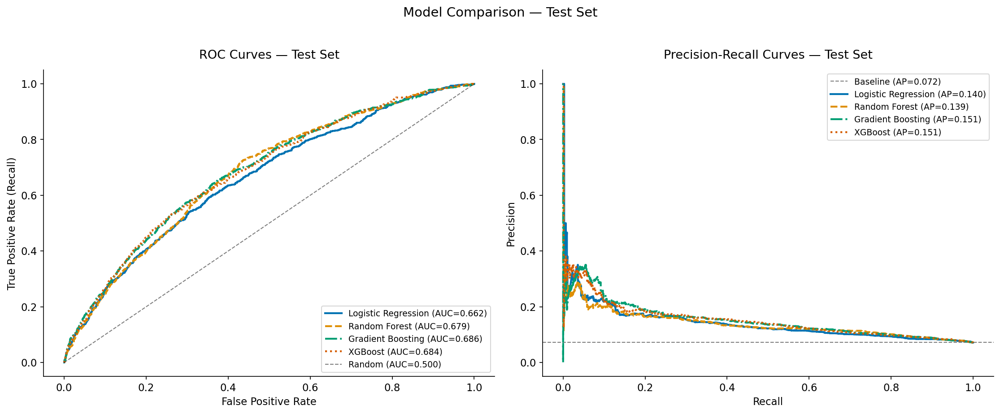
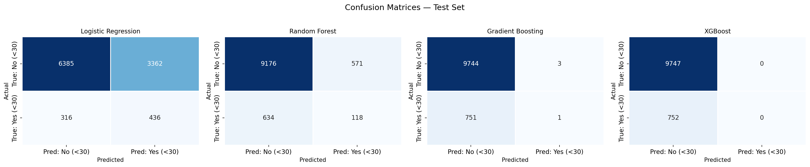
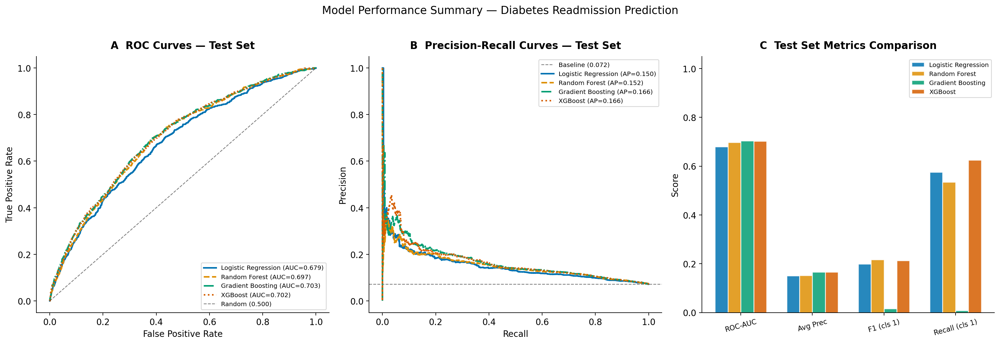

# Predicting 30-Day Hospital Readmission in Diabetic Patients
## A Machine Learning Analysis of the UCI Diabetes 130-US Hospitals Dataset

**Author:** Peter Adepoju  \
**Programme:** Decodelabs Data Science Internship - Week 2

---

## Abstract

This project analyzes the UCI Diabetes 130-US Hospitals dataset to predict
whether a diabetic patient will be readmitted within 30 days of discharge.
The workflow covers data cleaning, feature engineering, patient-aware splitting,
model training, evaluation, and fairness analysis.

Key results:
- The cleaned cohort contains 69,987 first encounters with an 11.2% positive class rate.
- Gradient Boosting achieves the best ROC-AUC at 0.6855, with XGBoost close behind at 0.6836.
- Logistic Regression captures the most positive cases, with recall of 0.5798, but lower ranking performance.
- Subgroup analysis shows meaningful variation across race, age, and gender.

For the full methodology, detailed results, and interpretation, see the full
report in [`paper_or_report/report.md`](paper_or_report/report.md) and the
accompanying PDF reports in the project root.

---

## 1. Background

Diabetes is a major driver of hospitalisation and early readmission. Predicting
30-day readmission can help hospitals target follow-up care, discharge support,
and care coordination to patients most at risk.

This project asks:

1. Can early readmission be predicted using clinical and administrative features?
2. Which models provide the strongest discrimination on unseen patients?
3. How stable are the results across demographic subgroups?

---

## 2. Data

- Dataset: UCI Diabetes 130-US Hospitals
- Source: https://archive.ics.uci.edu/dataset/296/diabetes+130-us+hospitals+for+years+1999-2008
- Period: 1999 to 2008
- Raw size: 101,766 encounters x 50 features
- After cleaning: 69,987 first encounters
- Target: Binary early readmission within 30 days
- Class balance: 88.8% negative, 11.2% positive

### Key Features

Clinical and administrative features include patient demographics, admission and
discharge metadata, laboratory result counts, procedure counts, medication
counts, 24 diabetes medication columns, HbA1c and glucose serum results, and
three ICD-9 diagnosis codes grouped into disease categories.

### Data Limitations

- The data are from 1999 to 2008, so clinical practice has changed substantially.
- Readmissions outside the same hospital system are not captured.
- Planned readmissions may be mixed in with the target label.
- Social determinants of health are not directly observed.

### Data

- Data folder: [Google Drive data folder](https://drive.google.com/drive/folders/1jmF1DWeETLHrCoJNLR6MlgVYHncbxsqX?usp=sharing)

---

## 3. Methods

### 3.1 Data Cleaning

- Replaced `?` with `NaN`
- Dropped `weight`, `payer_code`, and `medical_specialty`
- Removed encounters with hospice or expired discharge disposition
- Removed encounters with invalid or unknown gender
- Retained only the first encounter per patient to prevent leakage

### 3.2 Feature Engineering

- ICD-9 codes were mapped to disease category groups
- Age bins were encoded ordinally
- 24 medication columns were ordinal-encoded
- Derived features included `n_medications_active`, `n_medication_changes`,
  `total_prior_visits`, `had_prior_inpatient`, and `primary_diag_is_diabetes`
- HbA1c and glucose serum results were encoded with ordinal and binary tested flags

### 3.3 Data Splitting

Patient-aware `GroupShuffleSplit` was used for a 70% train / 15% validation /
15% test split by unique patient ID. Zero patient overlap was verified across
the splits.

### 3.4 Preprocessing

- `log1p` transform for right-skewed utilisation features
- `StandardScaler` fitted on training data only
- SMOTE applied to the training split to address class imbalance

### 3.5 Models

| Model | Key Hyperparameters |
|---|---|
| Logistic Regression | `C=1.0`, `class_weight='balanced'`, `lbfgs`, `max_iter=2000` |
| Random Forest | 300 trees, `max_depth=10`, `min_samples_leaf=20`, `class_weight='balanced_subsample'` |
| Gradient Boosting | 300 estimators, `max_depth=4`, `learning_rate=0.05`, `subsample=0.8` |
| XGBoost | 300 estimators, `max_depth=4`, `learning_rate=0.05`, `subsample=0.8`, `colsample_bytree=0.8`, `scale_pos_weight~7.9` |

### 3.6 Evaluation

- Primary metric: ROC-AUC
- Secondary metric: Average Precision / PR-AUC
- Clinical metric: Recall for class 1
- Bootstrap 95% confidence intervals with 1,000 resamples
- McNemar's test for pairwise comparison

---

## 4. Results

### 4.1 Exploratory Findings

#### Figure Gallery









The exploratory analysis shows strong relationships between prior utilisation,
medication burden, and early readmission risk. Patients with higher inpatient
history and more complex medication profiles tend to have elevated readmission
rates.

### 4.2 Model Performance







**Final test-set performance**

| Model | Accuracy | Balanced Acc. | F1 (class 1) | Recall (class 1) | ROC-AUC | Avg. Precision |
|---|---|---|---|---|---|---|
| Dummy Classifier | 0.9284 | 0.5000 | 0.0000 | 0.0000 | 0.5000 | 0.0716 |
| Logistic Regression | 0.6497 | 0.6174 | 0.1916 | 0.5798 | 0.6617 | 0.1403 |
| Random Forest | 0.8852 | 0.5492 | 0.1638 | 0.1569 | 0.6789 | 0.1385 |
| Gradient Boosting | 0.9282 | 0.5005 | 0.0026 | 0.0013 | 0.6855 | 0.1513 |
| XGBoost | 0.9284 | 0.5000 | 0.0000 | 0.0000 | 0.6836 | 0.1508 |

**Bootstrap 95% CI for ROC-AUC**

| Model | ROC-AUC | 95% CI |
|---|---|---|
| Logistic Regression | 0.6617 | [0.6418, 0.6813] |
| Random Forest | 0.6789 | [0.6603, 0.6997] |
| Gradient Boosting | 0.6855 | [0.6662, 0.7049] |
| XGBoost | 0.6836 | [0.6649, 0.7024] |

Gradient Boosting had the best discrimination, but Logistic Regression was the
strongest at identifying positive cases. This tradeoff matters because the
dataset is highly imbalanced, so accuracy alone is not a useful selection metric.

### 4.3 Interpretability and Fairness

The report uses SHAP and subgroup analysis to explain model behavior. The most
influential features are:

1. `number_inpatient`
2. `total_prior_visits`
3. `had_prior_inpatient`
4. `time_in_hospital`
5. `num_medications`

Available fairness and diagnostic visuals:

- [`10_correlation_heatmap.png`](reports/figures/10_correlation_heatmap.png)
- [`09_confusion_matrices.png`](reports/figures/09_confusion_matrices.png)
- [`10_feature_readmission_rates.png`](reports/figures/10_feature_readmission_rates.png)
- [`10_eda_storytelling_dashboard.png`](reports/figures/10_eda_storytelling_dashboard.png)

---

## 5. Discussion

1. Prior inpatient history and overall utilisation are the strongest signals for
   predicting 30-day readmission.
2. Gradient-boosted models provide the best overall ranking performance.
3. Logistic Regression offers the best recall, which may be preferable if the
   goal is to flag as many at-risk patients as possible.
4. Performance varies across demographic subgroups, so fairness review is
   important before any deployment.

Recommendations:

1. Use the model as a screening aid rather than a final decision-maker.
2. Prioritise follow-up interventions for patients with high inpatient history.
3. Choose the decision threshold based on clinical workflow capacity.

---

## 6. Limitations

- The data are historical and may not reflect current care pathways.
- Readmissions to different hospital systems are not observed.
- The class imbalance limits achievable recall.
- The model has not been externally validated.
- Administrative labels can include planned readmissions.

---

## 7. Ethics & Bias

Key concerns:

- Historical healthcare inequities may be embedded in the data.
- Subgroup performance differences can affect downstream care allocation.
- Predictions should always be reviewed by qualified clinical staff.
- This model is a research prototype, not a clinical device.

---

## 8. Reproducibility

```bash
pip install -r requirements.txt
python scripts/build_all_notebooks.py
jupyter notebook
```

Open the notebooks in order, starting from
[`notebooks/00_project_overview.ipynb`](notebooks/00_project_overview.ipynb).

---

## 9. Project Structure

```text
week2_project/
|-- configs/              # Project configuration
|-- models/               # Saved trained models
|-- notebooks/            # Ordered analysis notebooks
|-- paper_or_report/      # Full report sources, figures, and tables
|-- reports/              # Generated figures and tables
|-- scripts/              # Build and orchestration scripts
|-- src/                  # Reusable project code
|-- requirements.txt
`-- README.md
```
