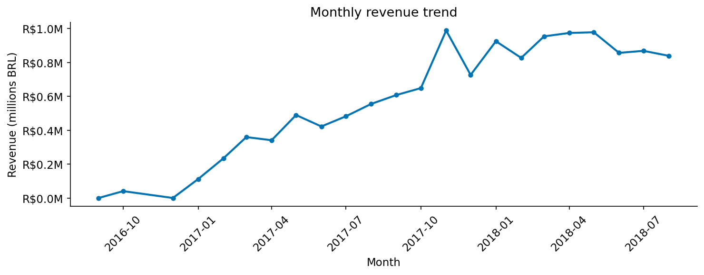
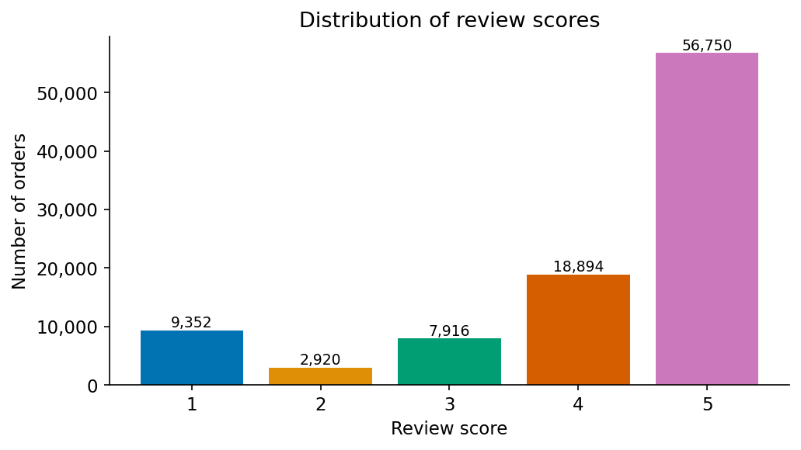
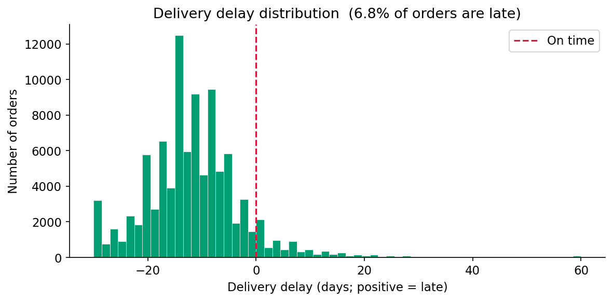
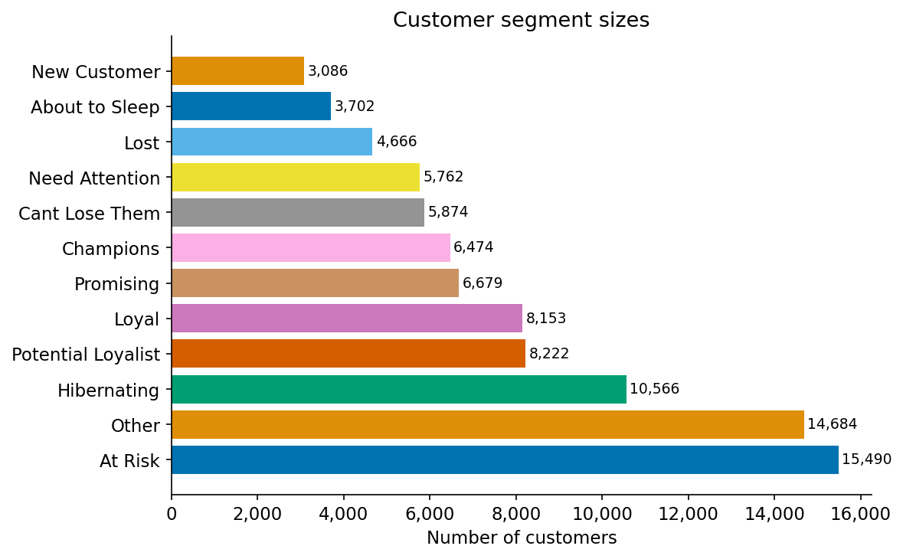
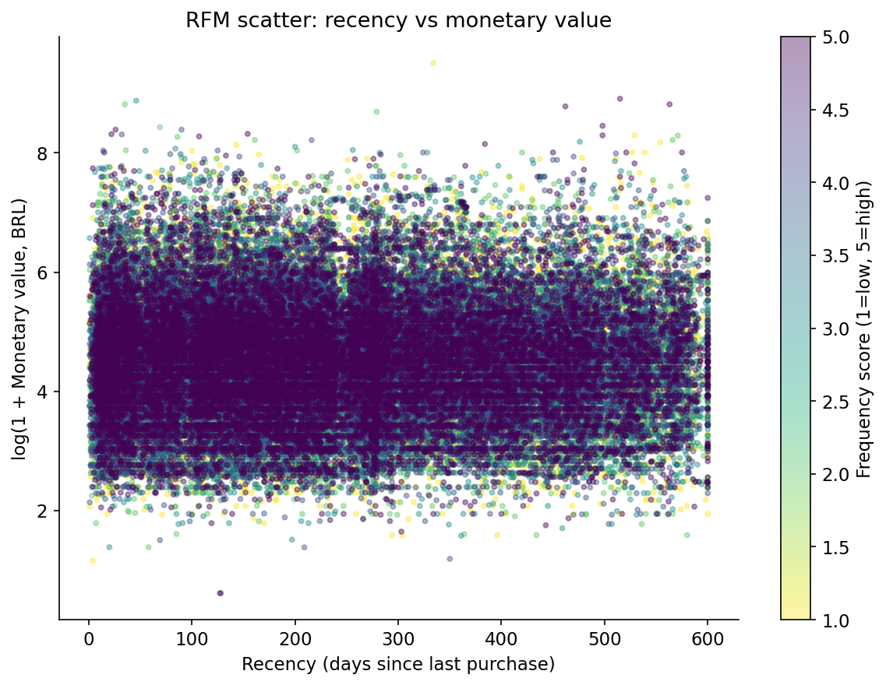
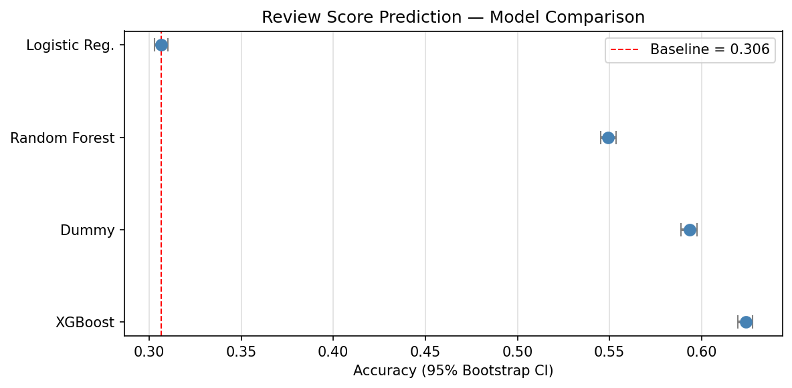
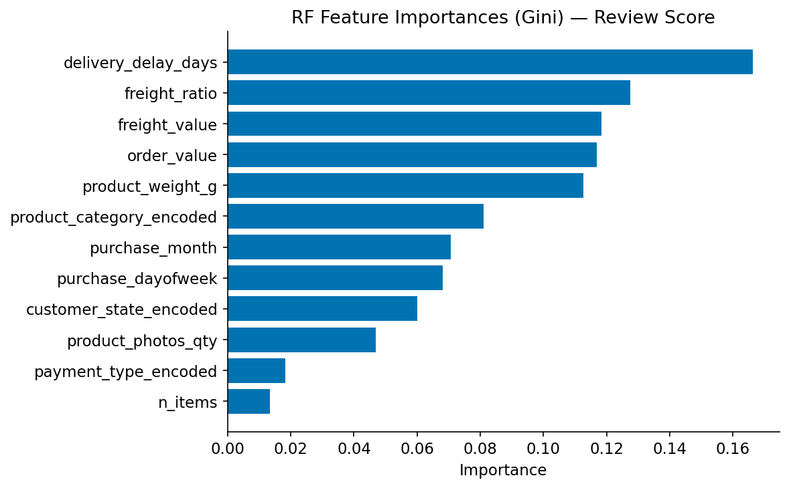

# E-Commerce Customer Intelligence Report
## Segmentation, Delivery Performance, and Review Score Prediction using the Olist Dataset

**Authors:** Peter Adepoju \
**Email:** petera@aims.ac.za

---

## Abstract

This report analyzes the Olist Brazilian e-commerce dataset from 2016 to 2018.
We study three questions: customer segmentation with RFM analysis, prediction of
late delivery, and prediction of review scores.

Key results:
- Champions account for 13.42% of revenue from 6,474 customers.
- Review scores fall sharply as delivery delay increases.
- XGBoost achieves 0.6238 accuracy on review-score prediction, versus 0.5933
  for the majority-class baseline.

All code, data download instructions, and reproducibility steps are available in
the project repository.

---

## 1. Introduction

E-commerce has grown rapidly in Brazil, and Olist connects many small sellers to
major retail platforms. Understanding purchasing behavior, delivery operations,
and satisfaction drivers is useful for seller retention, customer loyalty, and
platform growth.

Research questions:

1. Can customers be meaningfully grouped using RFM metrics?
2. Which order and product features best predict late delivery?
3. What features are most associated with low review scores?

Hypotheses:

- A small Champions group will account for a disproportionate share of revenue.
- Seller state, product weight, and order value will be among the top predictors
  of late delivery.
- Delivery delay will be the strongest predictor of review score.

---

## 2. Data

- Dataset: Olist Brazilian E-Commerce Public Dataset
- Source: https://www.kaggle.com/datasets/olistbr/brazilian-ecommerce
- License: CC BY-NC-SA 4.0
- Coverage: September 2016 to October 2018
- Scope: Orders, customers, sellers, products, payments, reviews, and geolocation
- Orders analyzed: 95,824 delivered orders

### Data Limitations

- No customer demographics.
- Geographic resolution is state-level, not exact distance.
- Product descriptions and images are unavailable.
- The data covers a single Brazilian marketplace over a limited time span.

---

## 3. Methods

### 3.1 Data Cleaning and Feature Engineering

- Filtered to delivered orders only.
- Parsed all timestamp columns and computed `delivery_delay_days` and `is_late`.
- Aggregated items to order level.
- Translated product category names from Portuguese to English.
- Encoded state, category, and payment variables as integer codes.

### 3.2 RFM Analysis

- Reference date: max purchase timestamp plus one day.
- Recency scored from 1 to 5, where 5 is most recent.
- Frequency and Monetary were also scored from 1 to 5.
- Standard RFM segment labels were assigned from the three scores.

### 3.3 Modeling

Task A: late delivery prediction using Dummy, Logistic Regression, Random Forest,
and XGBoost.

Task B: review score prediction using the same model set plus delivery delay and
payment features.

Train/test split:

- Training: orders before 2018-01-01
- Test: orders on or after 2018-01-01

### 3.4 Evaluation

- Accuracy and macro-F1
- 95% bootstrap confidence intervals
- Permutation testing

---

## 4. Results

### 4.1 Exploratory Findings







Late orders make up 6.66% of the reviewed orders in the delay breakdown table.
Very late orders average 1.72 stars, compared with 4.32 stars for very early
deliveries.

### 4.2 RFM Segmentation





| Segment | N customers | Revenue % | Avg Recency | Avg Frequency |
|---------|-------------|-----------|-------------|---------------|
| Champions | 6,474 | 13.42 | 90.89 | 1.17 |
| Loyal | 8,153 | 7.86 | 183.63 | 1.08 |
| At Risk | 15,490 | 23.66 | 380.98 | 1.05 |
| Lost | 4,666 | 1.06 | 475.36 | 1.00 |

### 4.3 Model Performance



| Model | Accuracy | Lower 95% CI | Upper 95% CI | Macro F1 |
|-------|----------|--------------|--------------|----------|
| Dummy | 0.5933 | 0.5889 | 0.5975 | N/A |
| Logistic Regression | 0.3065 | 0.3029 | 0.3103 | N/A |
| Random Forest | 0.5493 | 0.5450 | 0.5534 | 0.2924 |
| XGBoost | 0.6238 | 0.6195 | 0.6276 | 0.2551 |

### 4.4 Interpretability



Delivery delay is the clearest driver of low review scores, and model errors
are not evenly distributed across categories and states.

---

## 5. Discussion

1. A small high-value customer group generates a meaningful share of revenue.
2. Delivery delay is strongly associated with worse review scores.
3. Gradient-boosted models capture more signal for review prediction than the
   simpler baselines.

Recommendations:

1. Re-engage At-Risk customers with targeted offers.
2. Prioritize delivery speed for high-weight products.
3. Alert sellers when predicted review score falls below 3.

---

## 6. Limitations

- The model only uses behavioral and operational features.
- Review scores reflect more than delivery performance.
- RFM segments are descriptive, not causal.
- The time-based split may understate future drift.

---

## 7. Reproducibility

```bash
pip install -r requirements.txt
make download
make notebooks
```

Random seeds are fixed at 42 throughout. Approximate runtime is 20 to 30 minutes.

