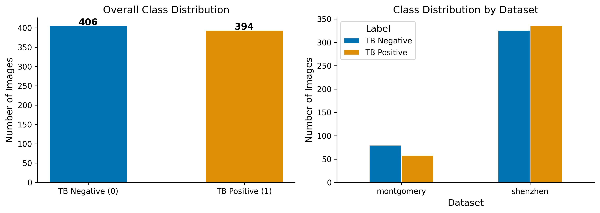
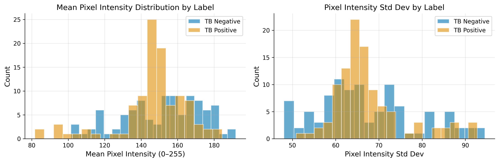
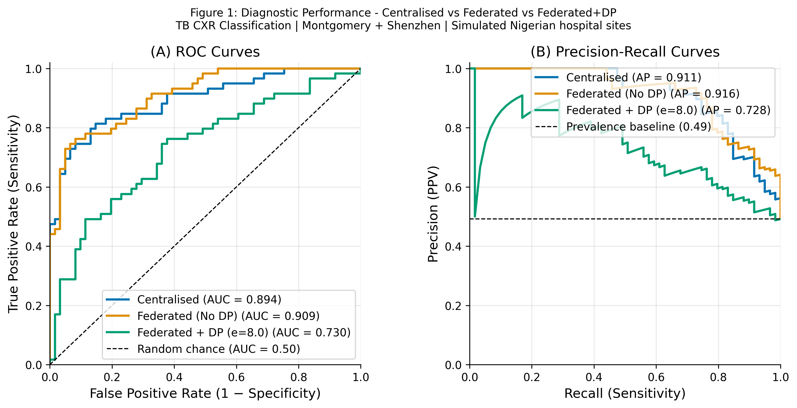
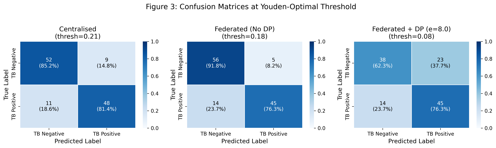
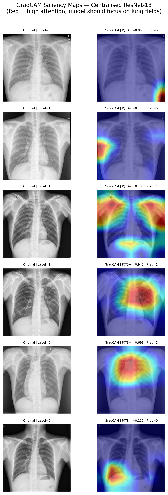
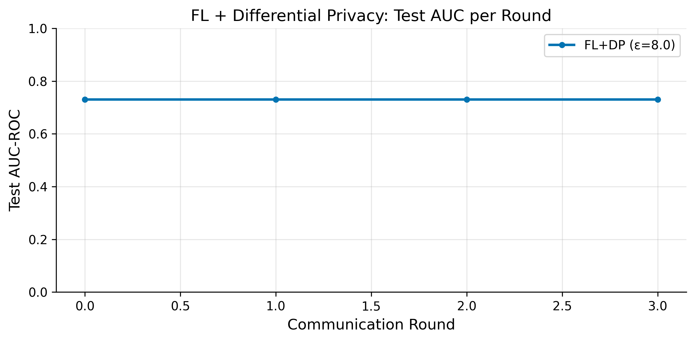

# FedTB-Nigeria: Federated Learning for Tuberculosis Diagnosis from Chest X-Rays Across Nigerian Teaching Hospitals

[](https://www.python.org/)
[](LICENSE)
[-green.svg)](https://flower.dev/)

---

## Abstract

This project studies privacy-preserving federated learning for tuberculosis
(TB) screening from chest X-rays using the Montgomery County and Shenzhen
datasets. The study simulates Nigerian teaching hospitals with site-aware data
splits and compares three model settings: a centralised baseline, federated
learning without differential privacy, and federated learning with
Opacus-based differential privacy.

Key results from the final evaluation:
- The test set contains 120 images, with 59 TB-positive and 61 TB-negative cases.
- The centralised model reaches 0.8939 AUC-ROC with 0.8136 sensitivity and
  0.8525 specificity.
- Federated learning without DP reaches 0.9086 AUC-ROC, but with lower
  sensitivity than the centralised model.
- Federated learning with DP reaches 0.7296 AUC-ROC and 0.6928 balanced
  accuracy.
- The centralised vs federated+DP comparison shows a statistically significant
  difference in errors, with McNemar p = 0.0125.
- Non-inferiority is not established for the federated+DP model under the
  0.05 AUC margin used in the report.

All code, figures, tables, and report sources are in this repository.

---

## Run The App

The demo is a small Gradio app for uploading a chest X-ray and viewing the
model output.

```bash
pip install gradio
python app_or_demo/gradio_app.py
```

Notes:
- Run this from the project root.
- The app expects the trained model at `models/centralised/best_model.pth`.
- If that file is missing, run the centralised training notebook or pipeline
  first.
- The demo is for research only and is not a clinical tool.

---

## 1. Introduction

Tuberculosis remains a major public health challenge, and chest X-rays can
support faster screening when radiology expertise is limited. However, medical
imaging data are difficult to centralise across hospitals because of privacy,
ethics, and logistics.

This project asks:

1. Can chest X-ray data from multiple sites be combined with federated learning
   without sharing raw patient images?
2. How much performance is lost when differential privacy is added?
3. Which failure modes matter most for TB screening?

The report is organised around three practical questions:
- Dataset structure and exploratory analysis
- Centralised versus federated model performance
- Error analysis, interpretability, and privacy-utility trade-offs

---

## 2. Data

- Dataset: Montgomery County TB Chest X-ray Set and Shenzhen Hospital Chest X-ray
  Set
- Combined size: 800 images
- Class balance: 394 TB-negative and 406 TB-positive images
- Test split: 120 images
- Image size: 224 x 224 RGB after preprocessing
- Simulation setup: 5 federated sites created with Dirichlet partitioning

### Data Limitations

- The source data are not Nigerian.
- No age, sex, HIV status, or other demographic metadata are available.
- Site partitioning is simulated, not collected from real hospitals.
- The dataset is small by deep-learning standards.

### Data and Report Assets

- [Full report PDF 1](fedtb_nigeria_latex_report1.pdf)
- [Full report PDF 2](fedtb_nigeria_latex_report2.pdf)
- [Full report PDF 3](fedtb_nigeria_latex_report3.pdf)
- [Full report PDF 4](fedtb_nigeria_latex_report4.pdf)
- [Appendix](fedtb_nigeria_latex_report_appendix.pdf)

---

## 3. Methods

### 3.1 Data Preparation

- Cleaned the dataset to 800 usable images.
- Resized all images to 224 x 224.
- Converted grayscale X-rays to 3-channel inputs for ResNet-18.
- Applied standard normalisation and augmentation.
- Split the data into train, validation, and test sets with a held-out test set.

### 3.2 Federated Learning

- Framework: Flower
- Strategy: FedAvg
- Site setup: 5 simulated teaching hospitals
- Backbone: ImageNet-pretrained ResNet-18

### 3.3 Differential Privacy

- Library: Opacus
- Privacy target in the report: (epsilon = 8, delta = 1e-5)
- BatchNorm layers were replaced with GroupNorm for DP compatibility

### 3.4 Evaluation

- AUC-ROC
- AUC-PRC
- Sensitivity
- Specificity
- PPV
- F1
- Balanced accuracy
- Bootstrap confidence intervals
- McNemar test
- Bootstrap AUC difference test

---

## 4. Results

### 4.1 Exploratory Findings





- The dataset is close to balanced, with a TB-positive rate of 49.2%.
- Mean pixel intensity differs slightly by label, which the report flags as a
  possible confound.

### 4.2 Core Performance Comparison





| Model | AUC-ROC | Sensitivity | Specificity | F1 | Balanced Accuracy |
|---|---:|---:|---:|---:|---:|
| Centralised | 0.8939 | 0.8136 | 0.8525 | 0.8276 | 0.8330 |
| Federated (No DP) | 0.9086 | 0.7627 | 0.9180 | 0.8257 | 0.8404 |
| Federated + DP | 0.7296 | 0.7627 | 0.6230 | 0.7087 | 0.6928 |

### 4.3 Statistical Comparison

- McNemar test statistic: 6.2439
- McNemar p-value: 0.0125
- Centralised AUC: 0.8939
- Federated+DP AUC: 0.7296
- Delta AUC: 0.1642
- 95% CI for delta AUC: [0.0755, 0.2538]
- Non-inferiority: not established at the 0.05 margin used in the report

### 4.4 Error Analysis and Interpretability




- False negatives are the most clinically important errors because they miss
  TB cases.
- The report includes GradCAM visualisations to show which image regions drive
  model predictions.
- The centralised model misses 11 TB-positive cases on the test set, while
  the reported error analysis also shows 9 false positives.

### 4.5 Privacy-Utility Trade-off



The report's DP analysis shows that stronger privacy generally reduces utility.
The final combined FL+DP model does not match the centralised baseline.

---

## 5. Discussion

The report supports four main conclusions:

1. The data are usable for a TB screening study, but the sample is small and
   non-Nigerian.
2. Federated learning without DP can perform competitively on AUC-ROC.
3. Adding DP introduces a clear performance cost.
4. Error analysis and interpretability remain essential for clinical trust.

Recommended next steps:

1. Validate on real Nigerian chest X-ray data.
2. Revisit the privacy-utility trade-off with additional DP tuning.
3. Add calibration analysis before any decision-support use.

---

## 6. Limitations

- The study uses simulated hospital sites, not real hospitals.
- The data do not include demographic metadata.
- Generalisation to Nigerian patients is not established.
- Clinical deployment is not supported by this work.
- Differential privacy is studied as a research prototype, not a final clinical
  safeguard.

See also:
- [Limitations note](paper_or_report/limitations.md)
- [Model card](paper_or_report/model_card.md)
- [Datasheet](paper_or_report/datasheet.md)

---

## 7. Reproducibility

```bash
pip install -r requirements.txt
python scripts/download_data.py
python scripts/run_all.py
```

If you prefer conda:

```bash
conda env create -f environment.yml
conda activate fedtb_nigeria
```

---

## 8. Project Structure

```text
week4_project/
|-- app_or_demo/         # Optional Gradio demo
|-- configs/             # Project configuration
|-- notebooks/           # Ordered analysis notebooks
|-- paper_or_report/     # Full report sources, figures, and tables
|-- scripts/             # Download and pipeline scripts
|-- src/                 # Reusable project code
|-- tests/               # Automated tests
|-- environment.yml
|-- Makefile
|-- pyproject.toml
|-- requirements.txt
`-- README.md
```

---

## 9. Report Figures

The main publication figures used in the report are stored here:

- [Figure 1: ROC and PRC comparison](paper_or_report/figures/fig1_roc_prc.png)
- [Figure 2: Privacy-utility trade-off](paper_or_report/figures/fl_dp_training_curves.png)
- [Figure 3: Confusion matrices](paper_or_report/figures/fig3_confusion_matrices.png)
- [Class distribution](paper_or_report/figures/class_distribution.png)
- [Pixel intensity distributions](paper_or_report/figures/pixel_intensity_distributions.png)
- [Error analysis examples](paper_or_report/figures/error_analysis_examples.png)
- [GradCAM examples](paper_or_report/figures/gradcam_examples.png)

For the full technical write-up, see the PDF reports listed above.
